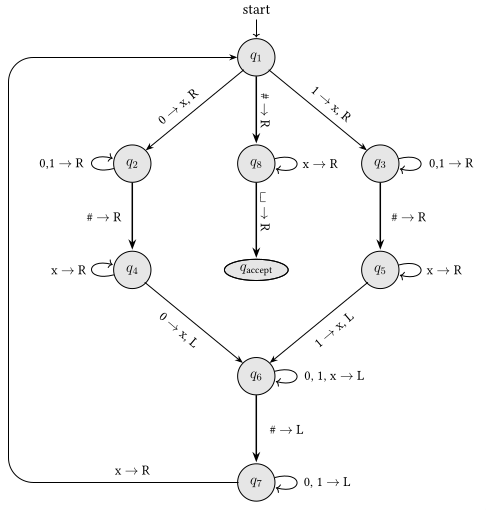

# Introductions and Definitions

## Definitions

We'll divide our questions about logic between two main topics:
* **Computability** - What question can logic ever solve?
* **Complexity** - What questions can logic solve efficiently?

We will use *decision problems* to talk about problems we are likely to have to
solve. A problem whose answer is either YES or NO.
* Given integers x and y, what is \\( x^2+y^2 \\)? (NOT DECISION PROBLEM)
* Given integers x,y,z, is \\( z = x^2+y^3 \\)? (DECISION PROBLEM)
* Given integers x and z, is there an integer y such that \\( z = x^2+y^3 \\)?
  (DECISION PROBLEM)

When dealing with a problem, we talk about the problem's inpus. However, we
think of inputs as inputs to a program, and we want to differentiate from it.
We will refer to "input" for a problem as an **instance.** So, an input to a
decision problem would be a **yes instance** or **no instance**.

We will talk about objects that can reasonably be encoded into a computer. i.e.
graphs, tables, not real numbers.

**Algorithm**: Logical sequence of steps for a problem instance, that will
terminate in a finite amount of time and give a solution to that instance.

## Turing Machines

From previous classes, we learned about DFSAs, which can accept lots of things,
but lack of memory meant it could not recognize anything that requires counting.

\\(L=\\{0^n1^n | n \in N\\}\\)

We also described PDA, that can recognize this using a stack for memory. Since
it is a stack, data has to be accessed in order, so it can't interleave patterns.
Also limited in calculations to size of the input string. 

\\(L=\\{w\\#w | w \in \\{0,1\\}^*\\}\\)

A Turing Machine allows arbitrarily large computing times, and access to
unrestricted memory by doing the following:
* The head of the tape moves either left or right when reading a character.
  determined by the arrow in the machine
* Have unlimited blank characters to the right of the input string
* Can write onto the tape, determined by the arrow in the machine

Let's feed 010#011 to the machine:

Starting with the initial configuration:  
\\(q_0 010\\#011\\)

Read 0, move to state 2, write x, move right:  
\\(x q_2 10\\#011\\)

Read 1, move right:  
\\(x1 q_2 0\\#011\\)  
\\(x10 q_2 \\#011\\)  
\\(x10\\# q_4 011\\)

Read 0, move to state 6, write x, move left:  
\\(x10 q_6 \\#x11\\)

And so on...  
\\(x1 q_7 0\\#x11\\)  
\\(x q_7 10\\#x11\\)  
\\(q_7 x10\\#x11\\)  
\\(x q_1 10\\#x11\\)  
\\(xx q_3 0\\#x11\\)  
\\(xx0 q_3 \\#x11\\)  
\\(xx0\\# q_5 x11\\)  
\\(xx0\\#x q_5 11\\)  
\\(xx0\\# q_6 xx1\\)  
\\(xx0 q_6 \\#xx1\\)  
\\(xx q_7 0\\#xx1\\)  
\\(x q_7 x0\\#xx1\\)  
\\(xx q_1 0\\#xx1\\)  
\\(xxx q_2 \\#xx1\\)  
\\(xxx\\# q_4 xx1\\)  
\\(xxx\\#x q_4 x1\\)  

Here there is no path to follow, so we reject  
\\(xxx\\#xx q_4 1\\)  

As we move through the TM, we move from one **configuration** to another

Formally, a TM is defined as \\(M=(Q, \Sigma, \Gamma, \delta, s, q_A, q_R) \\)
* \\(Q\\) is a set of states
* \\(\Sigma\\) is the input alphabet
* \\(\Gamma\\) is the tape alphabet, a superset of the input alphabet including
* \\(\delta\\) transition function
  \\(\delta:Q \times \Gamma \rightarrow Q \times \Gamma \times \\{L,R\\}\\)
* \\(s\\) the start state
* \\(q_A\\) accepting state. If we enter it, we accept and halt
* \\(q_R\\) rejecting state. If we enter it, we accept and reject. Often just
  implicitly used when no available out arrow to follow.

Additional notes:
* If we're on the left side of the tape and move left, we stay in place
* If we move past the input string, we have empty blank characters
* Blank characters are part of the tape alphabet, not input
