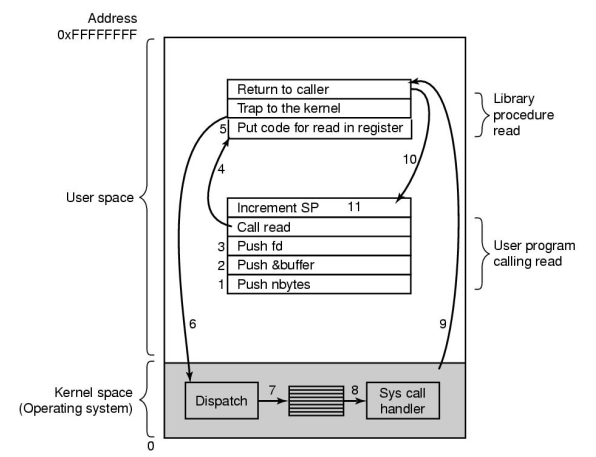

# System Calls
OS and user programs are isolated from each other. OS provides an API of system
calls that user programs can evoke.

User to Kernel mode
* Boot time (not really, runs in kernel mode already)
* Explicit system call - request for service by application
* Hardware interrupt
* Software trap/exception
* Hardware has table of interrupt service routines

Kernel to User
* Jump back to next application instruction

| Process Management Syscall		| Description								|
| --------------------------------- | ----------------------------------------- |
| pid=fork()						| Create child process identical to parent	|
| pid=waitpid(pid,&statloc,options)	| Wait for child to terminate				|
| s=execve(name,argv,environp)		| Replace process' core image				|
| exit(status)						| Terminate process execution, return status|

| File Management Syscalls			| Description								|
| --------------------------------- | ----------------------------------------- |
| fd=open(file,how,...)				| Open file for reading, writing, or both	|
| s=close(fd)						| Close open file							|
| n=read(fd,buffer,nbytes)			| Read data from file into buffer			|
| n=write(fd,buffer,nbytes)			| Write data from buffer into file			|
| position=lseek(fd,offset,whence)	| Move file pointer							|
| s=stat(name,&buf)					| Get file's status information				|

## Tracing Read Syscall

1. User program calls C lib function with arguments
2. C lib function arranges to pass args to OS, including syscall identifier
3. Execute special instruction to trap to system mode
4. Syscall handler figures out which syscall is needed and calls routine for
   that operation

Adds extra level of indirection through syscall handler, rather than direct
control flow to called function. Enforce separation of userspace and kernel

Kernel must verify arguments passed to it. For example, sys_write():
* must check whether fd is a file descriptor of recently opened file
* must check if allowed to write to it

Fixed number of arguments can be passed to registers. Kernel must copy data from
user space to its own buffers. Result of a syscall is returned in register.
