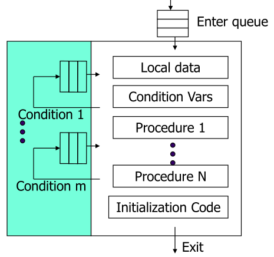

# Monitors
Similar to an *abstract data type* (data and operations on the data), except only
one process can be active within the monitor at a time
* local data accessed by monitor's procedures (not by external procedure)
* process *enters* monitor by invoking one of its procedures
* other processes attempting to enter monitor are blocked

A process in the monitor may need to wait for something to happen:
* need to allow other process to use the monitor
* provide special variable type called a *condition*
* operations on *condition* variable are:
	* **wait** (suspend the invoking process)
	* **signal** (resume exactly one suspended process)  
	  if no process is suspended, signal has no effect

The benefits of a monitor over semaphores is that locks and conditions are
encapsulated inside a data structure. In java, the **synchronized** keyword
means the lock and unlocking is done for you and guarantees mutual exclusion.



## Monitor Semantics for Signal
* Hoare monitors
	* signal() immediately switches from the caller to a waiting thread
	* need another queue for signaler, if signaler was not done using the
	  monitor
* Brinch Hansen
	* signaler must exit monitor immediately. signal() always last statement
	  in the monitor procedure
* Mesa monitors
	* signal() places a waiter on ready queue, but signaler continues inside
	  monitor

## Monitor Banking Example
Threads must acquire the monitor's lock to ensure mutual exclusion
```c
Monitor Account {
	int balance;
	pthread_mutex_t lock;
	void withdraw(int amount) {balance -= amount};
	void deposit(int amount) {balance += amount};
}
```

## Monitor Reader/Writers Problem
```c
typedef struct file_s {
	int readcount;
	pthread_cond_t read;
	pthread_cond_t write;
	pthread_mutex_t lock;
} file_t;

/* Initialize values */
file_t file;

void read_file() {
	file.readcount++;
	pthread_mutex_lock(file.lock);
	read;
	file.readcount--;
	pthread_mutex_release(file.lock);

	if (file.readcount == 0) {
		pthread_cond_signal(file.write);
	}
	else {
		pthread_cond_signal(file.read);
	}
}

void write_to_file() {
	pthread_mutex_lock(file.lock);
	while(readcount > 0) {
		pthread_wait_cond(file.write, file.lock);
	}
	write;
	pthread_mutex_release(file.lock);
	pthread_cond_signal(file.write);
	pthread_cond_signal(file.read);
}
```

## Monitor Bounded Buffer Example
We want to use a monitor to control access to a size N buffer. As well as a lock,
we need two conditions:
* Producers need the buffer to be not full
* Consumers need the buffer to be not empty

```c
#define N 100
typedef struct buf_s {
	int data[N];
	int inpos;
	int outpos;
	int numelements;
	pthread_cond_t notFull;
	pthread_cond_t notEmpty;
	pthread_mutex_t lock;
} buf_t;

/* Initialize values */
buf_t buf;

void add_to_buff(int value) {
	pthread_mutex_lock(buf.lock);

	while (buf.numelements == N) {
		// buffer is full, wait
		pthread_cond_wait(buf.notFull, buf.mylock);
	}
	buf.data[buf.inpos] = value;
	buf.inpos = (buf.inpos + 1) % N;
	buf.numelements++;

	pthread_cond_signal(buf.notEmpty);
	
	pthread_mutex_release(buf.lock);
}

int remove_from_buff() {
	int val;
	pthread_mutex_lock(buf.lock);
	
	while (buf.numelements == 0) {
		// buffer is empty, wait
		pthread_cond_wait(buf.notEmpty, buf.lock);
	}
	val = buf.data[buf.outpos];
	buf.outpos = (buf.outpos + 1) % N;
	buf.numelements--;

	pthread_cond_signal(buf.notFull);

	pthread_mutex_release(buf.lock);
	return val;
}
```

Note that when a process waits on a condition and is signalled, it is only a hint
that the condition is true but not a guarantee once it enters the monitor.
Another process could change the value while the process is queuing up. That's
why the while loop is needed, so the buffer goes back to the waiting queue if the
condition is not satisfied.
