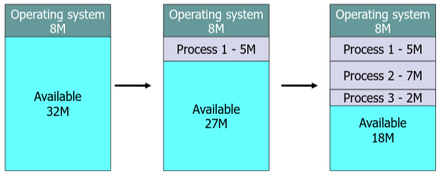
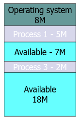

# Dynamic Partitioning
In dynamic partitioning, we partition available space to be the size of each
process.

Dynamic partitioning doesn't cause internal fragmentation or overlays. However,
as processes come and go, they form "holes" in the memory, called *external
fragmentation*.

The 7MB partition may be too small for other processes to occupy.

OS may deal with this by *compacting*, allocating process 3 immediately
following process 1, to create a 25MB free partition. Requires processes to be
relocatable. However, compaction is time-consuming and not always possible.

## Placement Algorithms
Compacting can be reduced by being careful about how memory is allocated to
processes over time.

* **First-fit**: Choose first block that is large enough; search can start at
	beginning, or where previous search ended (called next-fit)
	* Simplest, often fastest and most efficient
	* May leave small fragments near start of memory that must be searched
	  repeatedly
* **Best-fit**: Choose block closest in size to the request
	* Left-over fragments tend to be small and unusable
	* In practice, similar storage utilization to first-fit
* **Worst-fit**: Choose the largest block
	* Not as good as best-fit or first-fit in practice
* **Quick-fit**: Keep multiple free lists for common block sizes
	* Great for fast allocation, generally harder to coalesce

## Address Translation (Partitioning)
During execution time, addresses need to be translated from logical to physical
addresses. 

For each process, we need to store the start of the process memory and the last
address of the process. They are stored in two registers "base" and "limit".

Adding the logical address and base value returns the physical address. Logical
address must be checked so that it is within the process space (must be less
than limit).

When assigned to the CPU, Memory Management Unit loads the base register, loads
the limit register, and causes an addressing error if the address is not in the
process space.

