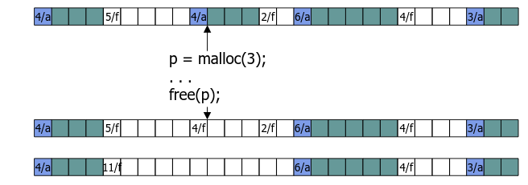

## Heap Management
Each process has dynamic heap memory, allocated using malloc() and free().
malloc(size) returns a pointer to a block of memory at least "size" bytes or
NULL. free(ptr) releases previously allocated block pointed to by "ptr".

One way to manage memory allocation is using bitmaps, with 1 representing an
allocated unit of memory, and 0 representing a free unit of memory.

If we wanted to allocate 6 units however, we would need to look for 6
consecutive 0s in the bitmap. Although there is more than 6 units available, we
cannot allocate. Additionally, bitmap tracking is slow as we have to walk
through the bitmap string.

Linked list can be used to reduce the linear walking of the bitmap string.

Maintain a linked list of allocated and free segments.

List can be maintained implicitly, using the head of each segment to indicate
whether the next units are allocated or free, and how many.

List maintained explicitly stores pointers in free blocks, creating a
doubly-linked list.

Free blocks next to each other can be *coalesced* together when freed.

