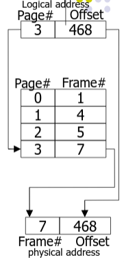

## Address Translation (Partitioning)
During execution time, addresses need to be translated from logical to physical
addresses. 

For each process, we need to store the start of the process memory and the last
address of the process. They are stored in two registers "base" and "limit".


Adding the logical address and base value returns the physical address. Logical
address must be checked that it is within the process space (must be less than
limit).

When assigned to the CPU, Memory Management Unit loads the base register, loads
the limit register, and causes an addressing error if the address is not in the
process space.


## Address Translation (Paging)
Address translation for paging is different, as processes are partitioned into
pages and not contiguous.

For each process, the OS needs to maintain a *page table* for each process. The
page table records which physical frame holds each page.

Instead of relative addresses, programs store virtual addresses:
* page number + page offset (concatenate)
* page number = vaddr / page_size
* page offset = vaddr % page_size

If addresses are 16 bits, and pages are 4096 bytes:
* Use 12 bits (2^12 = 4096) for offset
* The remaining 4 bits (2^4 = 16) represent the max number of pages for any
  process

Translating virtual address 0x3468 (hex)
```
page = vaddr >> 12 = 3 (right shift 12 bits)
```
Look up in the page table, what frame page 3 is stored in
```
page 3 is stored in frame 7
```
Combine frame number with page offset
```
offset = vaddr % 4096
paddr = (frame << 12) | offset)
```


