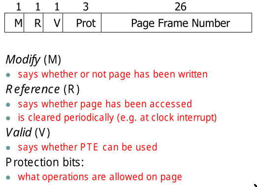
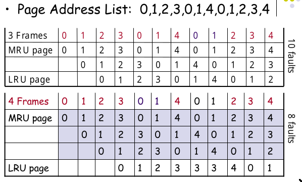

# Replacement Policy
When memory becomes full, and a page needs to be allocated to memory, we need
to choose a victim page to evict. Good replacement policies reduce the number
of page faults that occur. We can evaluate the performance of a replacement
algorithm by counting the number of page faults.

If an evicted page is accessed by a process:
1. the invalidated PTE causes a trap (page fault).
2. trap runs the OS page fault handler
3. handler uses invalid PTE to locate page in swap file
4. reads page into physical frame, updates PTE to point to it
5. restarts process

During a page fault, the OS needs to execute an I/O task to get the process
from swap. However, it is unable to execute anything else in between.


## Belady's Algorithm
Belady's is the optimal algorithm for choosing a victim page, and has the
lowest fault rate for any page reference stream.

Pretend that we have access to a reference string.
```
2,3,2,1,5,4,5,3,5,3,2
```


Misses can occur in two ways:
* **Cold misses**: The first access to a page needs to be allocated to a frame.
* **Capacity misses**: Caused by replacement due to limited size of memory

1. The best page to evict is the one never used again. We will never fault on
   it.
2. Never is a long time, so picking the page closest to "never" is the next
   best thing. Evicting the page that won't be used for the longest period of
   time minimizes the number of page faults.

Belady can't be implemented in practice, but it is used as a measurement for
other algorithms. Good algorithms are close to belady, while bad algorithms
would be closer to the fault rate of randomly picking pages.

Each page table entry, we may use some extra bits to store some information:



## Not-Recently-Used (NRU)
We divide pages into four different classes:
* Class 1: Not referenced, not modified
* Class 2: Not referenced, modified
* Class 3: Referenced, not modified
* Class 4: Referenced, modified

Remove pages at random from lowest-numbered class that's not empty

## First-In-First-Out (FIFO)
In FIFO, we implement a queue for the processes. It is easy to implement. The
idea is that the page brought in the longest time ago is likely to not be used.


FIFO suffers from "Belady's Anomaly". The fault rate might **increase** when
the algorithm is given more memory.

## Second-Chance (Clock)
Second-chance combines both FIFO and NRU.
* Don't evict the oldest page if it has been used
* Evict the oldest page that has not been used

Pages that are used often enough to keep reference bits set will not be
replaced.

* Arrange all physical page frames in a big circle
* Clock hand sweeps through pages in circular order
	* If a ref bit is off, it hasn't been used recently, so evict this page
	* If a ref bit is on, turn it off and go to the next page


## Least Recently Used (LRU)
Least Recently Used uses reference information to make a more informed
replacement decision.
* On replacement, evict the page that has not been used for the longest time in
  the past

LRU can be implemented in two ways:
* Take a time stamp every reference, evict page with oldest time stamp
	* We need to make the PTE large enough to hold meaningful time stamps
	* Need to examine every page on eviction to find one with the oldest time
	  stamp
* Keep pages in a stack. On reference, move the page to the top of the stack.
  On eviction, replace page at the bottom.
	* Need costly software operation to manipulate stack on **every** memory
	  reference



Exact LRU is the closest to belady, but both methods of implementing it exactly
is very costly.

LRU can be approximated instead, using the PTE *reference* bit:
* Initially, all R bits are zero; as processes execute, bits are set to 1 for
  pages that are used.
* Periodically examine the R bits - we do not know *order* of use, but we know
  pages that were (or were not) used

Additional-Reference-Bits Algorithm:
* Keep a counter for each page. At regular intervals, for every page do:
1. Shift R bit into high bit of counter register
2. Shift other bits to the right
3. Pages with "larger" counters were used more recently

## Least-Frequently-Used (LFU)
For each page, we count the number of uses of a page
* Replace the page used least often
* Pages that are heavily used at one time tend to stick around even when not
  needed anymore
* Newly allocated pages haven't had a chance to be used much

Equivalently, Most-Frequently-Used (MFU) favours new page. Both are poor
approximations of Belady's.


