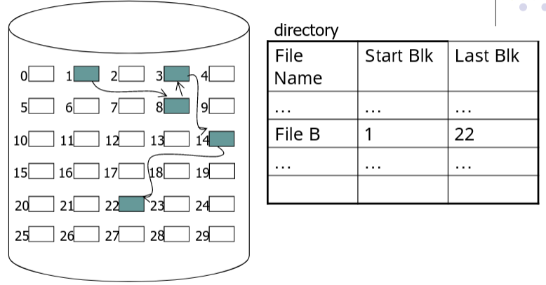
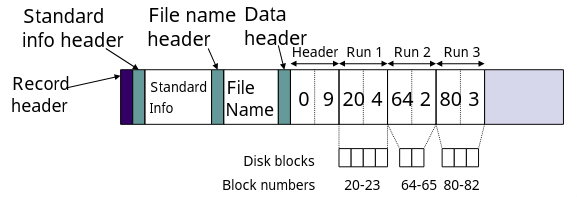

# File Systems

File systems provide an abstraction for storage. It allows us to:
* organize files in directories
* share data between processes, people, and machines
* protect data from unwanted access

File systems determine a block size (e.g. 4KB). Disk space is allocated in
blocks.

It maintains a "Master Block", that determines the location of the root
directory. Stored at a well-known disk location, and replicated across disk for
reliability.

A free map (bitmap) determines which blocks are free or allocated. Also stored
on disk, and cached in memory for performance.

## Disk Layout
Files may span multiple disk blocks. There are a few ways we can find all the
blocks for a file:

## Contiguous Allocation
Like memory, storing files contiguously causes fragmentation and needs
compaction. It is fast, and simplifies directory access

## Linked/Chained structure
Directory points to the first block of the file, while every block of the file
points to the next block. Good for sequential access, but bad for others.

Linked allocation is flawed, as if any block along the chain is corrupted, the
rest of the file is lost.

## Inodes
Inodes are an indexed structure used in Unix. Each inode contains 15 block
pointers.
* 0-11 points directly to blocks
* 12 points to singly indirect block of pointers
* 13 points to doubly indirect block of pointers
* 14 points to triply indirect block of pointers

## Original Unix File System
Simple and straightfoward to implement. However, with the way inodes and
blocks are accessed, we need to jump back and forth constantly. It will be
expensive, as we fill to the end of the data blocks.

## Fast File System
FFS improves disk utilization, and decreases response time.

Partition into cylinder groups. Attempt to keep all of these in the same
cylinder group:
* File blocks
* Files in the same directory
* Inodes for files

Keep about 10% of each cylinder group empty, in anticipation of files growing
in size. If a cylinder group is full, just allocate to the next one.

To allocate blocks in a cylinder group:
1. Traverse the allocation bitmap
2. Find the first byte of all zeroes
3. Backtrack the bits to check for zero

## The Linux Second Extended File System (EXT2)
An extension of the fast file system, used by Linux

Deleting the file 'voluminous' from a directory

Accessing file blocks in the file system. Shows the relationship between file
descriptor table, open file description table, and i-node table.

## Synchronous Writing

Metaupdates are synchronous actions (can't do them at the same time, only one
after the other). Consider the following situations:
* Write inode to disk before its name is entered in a directory
* Remove directory name before the inode is deallocated
* Write deallocated inode to disk before its blocks are placed into the
  cylinder group free list

If the computer/server crashes during these actions, it can cause either inodes
that point to blocks it does not own, or blocks that can no longer be accessed.
Some solutions are:
* fsck (file system check) - Scan the file system structure and restore
  consistency.
* log updates - Before performing any disk writing, record your intention to do
  so in a log file. Post-crash, we can roll-back or roll-forward based on the
  actions recorded in the logs

## Log Structured File System
As the size of memory grew, so did the amount of data that could be cached. As
a result, reading data was snappy, but writing data needed to be improved. 

Using the log strategy, store **all** file system data in a continuous log.
Since inodes are scattered all over the place, we need an inode map, instead of
a simple index. A cleaner reclaims space from overwritten or deleted blocks.

Reading from the log file system goes as such:
1. Read superblock to find index file
2. Read index file (linear search on block of inodes)
3. Use disk address in inode to read the block of index file containing the
   inode-map
4. Get file's inode
5. Use inode to find the file's data blocks

## Windows New Technology File System (NTFS)
Replaced window's FAT file system, made with the following goals:
* Eliminate fixed-size short names
* Implment a more thorough permissions scheme
* Good performance
* Support large files
* Provide compression, encryption, and types

Each volume is a linear sequence of blocks (about 4K in size), each with a
Master File Table (MFT).

Each MFT record is for a 1KB sequence of records. It stores a pair of (starting
block, # of blocks). If all data doesn't fit in an MFT record, extension
records can be used to hold more.

Small directories use MFT records, with entries stored as a list. Large
directories use B+ trees instead.

