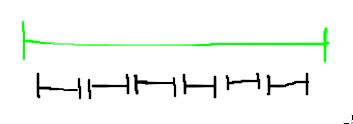
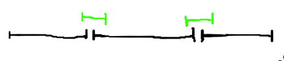
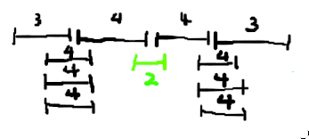

# Interval Scheduling
Given a set of intervals/jobs, find the largest subset of intervals that do not
overlap.

* Input: n intervals, [s(i), f(i)] where s(i) is the start time of interval i,
	f(i) is the finish time of interval i.
* Output: Max cardinality feasible subset of he input set of intervals

Intervals i and j overlap if s(i) \leq s(j) \leq f(i). A subset solution is
"feasible" if no such two intervals exist in the set.

In other words, we want the largest subset of intervals, such that no
two intervals overlap.

For this problem, we want to sort the intervals in some order so that we can
greedily pick intervals to build up the solution.

```c
A := \emptyset
for each interval i in sorted order do
	if i overlaps no interval in A then
		A := A \cup {i}
return A
```

## Strategy 1: Sort by Start Time
Not a feasible solution. We can construct a set of intervals, for which the
strategy would fail. Note that we can stuff as many intervals as we want,
meaning we may not be anywhere near an optimal set.



## Strategy 2: Sort by Length
Produces a feasible solution. However, we can also construct a set that shows
it is not an optimal strategy.



## Strategy 3: Sort by Number of Conflicts
Produces a feasible solution, but yet again, we can construct a set that shows
it is not optimal.



## Strategy 4: Sort by End Time
Sorting by end time is the optimal strategy. Intuitively, choosing the interval
with earliest end time, leaves the most time afterwards for other intervals to
add to the set.

## Greedy Stays Ahead Proof of Optimality
Consider two sets A and A*.
A is constructed by the greedy algorithm picking intervals by earliest end time
A* is some optimal set.

Let i_1, i_2, ..., i_n be the intervals in A in left to right order.
Let j_1, j_2, ..., j_m be the intervals in A* in left to right order.

We will show that for k=1..n, f(i_k) \leq f(j_k), through induction.

For the base case, n=1. It is trivial that f(i_1) \leq f(j_1), as the earliest
end time interval is picked, without having to consider overlapping other
intervals.

The induction hypothesis, is that for k=1..n, f(i_k) \leq f(j_k). We will
want to prove that the hypothesis holds for k=1..n+1.

f(i_k) \leq f(j_k) by I.H.
f(i_k) \leq s(j_k+1) by feasibility of A* and left to right ordering
f(i_k) \lt f(j_k+1)

Notice that j_k+1 does not overlap with any interval in A, and thus is a
feasible choise fo i_k+1.

Consider the step when the algorithm adds interval i_k+1. If there are no
feasible choices with finish time before f(j_k+1), the algorithm will pick
j_k+1 which is itself a feasible choice. Thus, f(i_k+1) \leq f(j_k+1).

Now, we need to prove that n=m. Suppose, for contradiction, that n \lt m. We
know that f(i_n) \leq f(j_n). However, since j_n+1,...,j_m are all feasible
choices, we can extend the size of A so that n=m. Therefore, A and A* have the
same max cardinality, and the algorithm is optimal.
