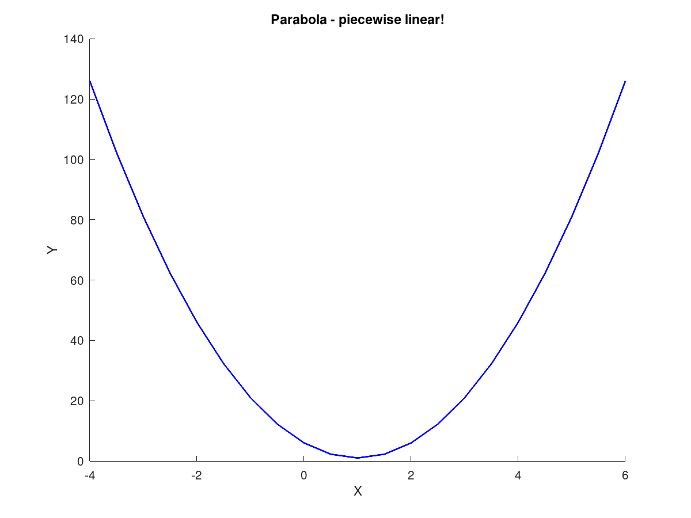
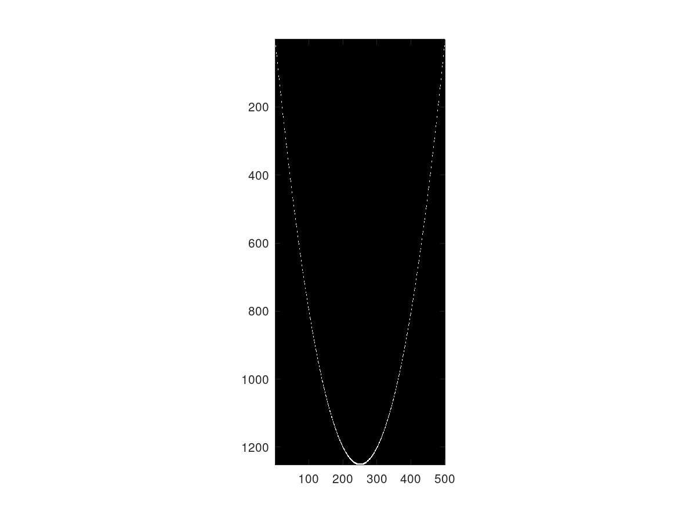
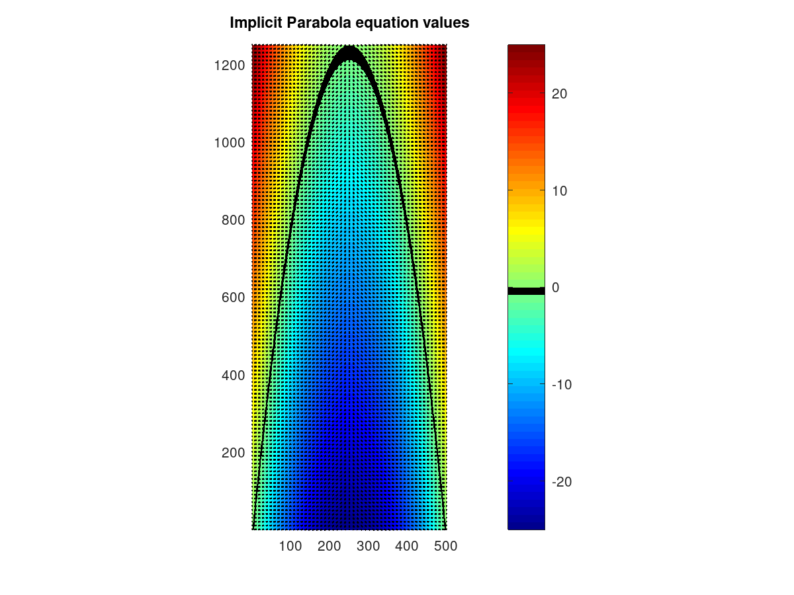
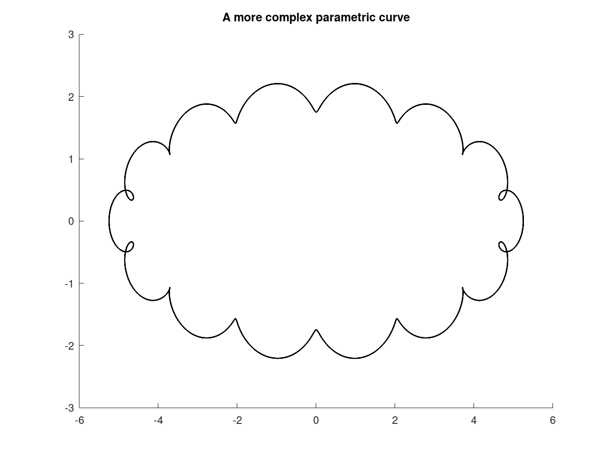

# Parametric Curves

3D Curves can be repesented in three different ways:
* Explicit form
* Implicit form
* Parametric form

## Explicit Form

The explicit form of a curve is given as:

$y = f(x)$, given x, find y

* The explicit form of a line is $y=mx+b$
* Some shapes cannot be expressed in explicit form, such as circles or vertical
  lines.
* To plot a function in explicit form in the range [a,b], you would evaluate
  the function at infinitesimally small incrememts. However, if you zoom in far
  enough on the picture, it will turn out to be a series of discrete dots

* Another method is to evaluate at points as before, but to connect each point
  together. The result is a piecewise curve that if you zoom in enough, will be
  a series of straight lines

## Implicit Form

The implicit form of a curve is given as:

$f(x,y)=0$, or $f(p)=0$, where $p$ is a vector

* The implicit form of a line is
  $(x-x_0)(y_1-y_0)-(y-y_0)(x_1-x_0)=0$, where $p_0=(x_0,y_0)$ and
  $p_1=(x_1,y_1)$
* The line points in the direction $d = p_1 - p_0$
* The normal to the line must be perpendicular to the direction, and is given as
  $n = (-d_y, d_x) or n = (d_y, -d_x)$. In other words, swap vector components
  and negate one
* For any point $p$ on the line, $(p-p_0) \cdot n = 0$
* The implicit form of a circle with radius $r$ and center $p_c=(x_c,y_c)$ is
  $(x-x_c)^2+(y-y_c)^2=r^2$, or ||p-p_c||^2=r^2 in vector form

* The implicit form gives a way to draw a continuous curve by evaluating the
  function at a matrix of points, and setting the pixel if it is within some
  epsilon from zero.

* $(p-p_0) \cdot n$ gives a projection of the vector onto the normal. This
  means that the farther $p$ is from the line, the greater the value of the
  normal.

## Parametric Form

The parametric form of a curve is defined by two vector components, a point and
a vector.

$p = f(\lambda)$

* The parametric form of a line is given as $r(\lambda)=p_0 + \lambda * d$,
  where $p_0$ is a point on the line, $d$ is a direction vector, and $\lambda$
  is a scaling factor for the direction
* Bounds can be placed on lambda for the parametric form of a line to form:
  * A line segment: $0 \leq \lambda \leq 1$
  * A ray from $p_0$ towards $p_1$: $\lambda \geq 0$
  * A line passing through $p_0$ and $p_1$: no bounds

* The parametric form of a circle with radius r, is $p(\lambda)=(r\cos(2\pi
  \lambda), r\sin(2\pi\lambda)$, with $0 \leq \lambda \leq 1$
* To plot a circle, you can evaluate the parametric form at a sequence of
  $\lambda$.
* You can also add together parametric circles to form interesting shapes
* Here, $c(t)$ forms a large ellipse, and $d(t)$ forms a very small circle that
  goes in a circlee 15 times faster than $c(t)$. Evaluate lambda from $ 0 \leq
  \lambda \leq 2\pi$

\[
c(t)=[5\cos(t) 2\sin(t)]
d(t)=[.25cos(15t) .25\sin(15t)]
e(t)=c(t)+d(t)
\]

# Tangents and Normals
The tangent to a curve at a point is the instantaneous direction of the curve.
It intersects the curve at a single point. It is given by the derivative of the
parametric form, with respect to $\lambda$

\[
t(\lambda) =
\frac{dp(\lambda)}{d\lambda} =
(\frac{dx(\lambda)}{d\lambda}, \frac{dy(\lambda)}{d\lambda}
\]

The normal is a vector perpendicular to the tangent. For a closed curve, the
normal can point either away from the surface, or towards the center, in which
case it would be an inward/outward facing normal. 

From the implicit form, the normal at a point is the gradient:

\[
n(p) =
\nabla f(p) =
(\frac{df(x,y)}{dx}, \frac{df(x,y)}{dy}
\]
