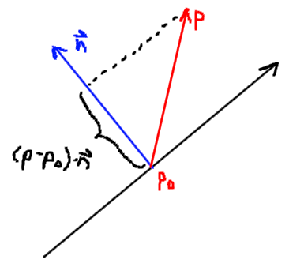
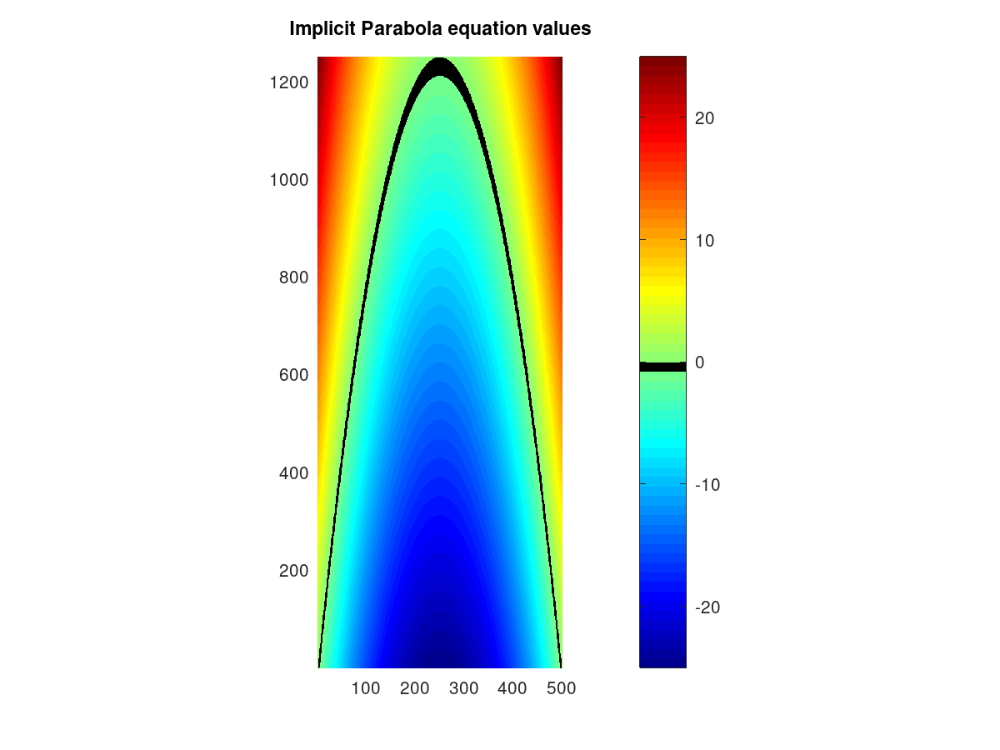

# Parametric Curves

3D Curves can be repesented in three different ways:
* Explicit form
* Implicit form
* Parametric form

## Explicit Form

The explicit form of a curve is given as:

$y = f(x)$, given x, find y

* The explicit form of a line is $y=mx+b$
  Some shapes cannot be expressed in explicit form, such as circles or vertical
  lines.
* To plot a function in explicit form in the range [a,b], you would evaluate
  the function at infinitesimally small incrememts. However, if you zoom in far
  enough on the picture, it will turn out to be a series of dots and discrete

* Another method is to evaluate at points as before, but to connect each point
  together. The result is a piecewise curve that if you zoom in enough, will be
  a series of straight lines

## Implicit Form

The implicit form of a curve is given as:

$f(x,y)=0$, or $f(p)=0$, where $p$ is a vector

* The implicit form of a line is
  $(x-x_0)(y_1-y_0)-(y-y_0)(x_1-x_0)=0$, where $p_0=(x_0,y_0)$ and
  $p_1=(x_1,y_1)$

* The implicit form gives a way to draw a continuous curve by evaluating the
  function at a matrix of points, and setting the pixel if it is within some
  epsilon from zero.

* The line points in the direction $d = p_1 - p_0$
* The normal to the line must be perpendicular to the direction, and is given as
  $n = (-d_y, d_x) or n = (d_y, -d_x)$. In other words, swap vector components
  and negate one
* For any point $p$ on the line, $(p-p_0) \cdot n = 0$
* The implicit form of a circle with radius $r$ and center $p_c=(x_c,y_c)$ is
  $(x-x_c)^2+(y-y_c)^2=r^2$, or ||p-p_c||^2=r^2 in vector form

* $(p-p_0) \cdot n$ gives a projection of the vector onto the normal. This
  means that the farther $p$ is from the line, the greater the value of the
  normal.

