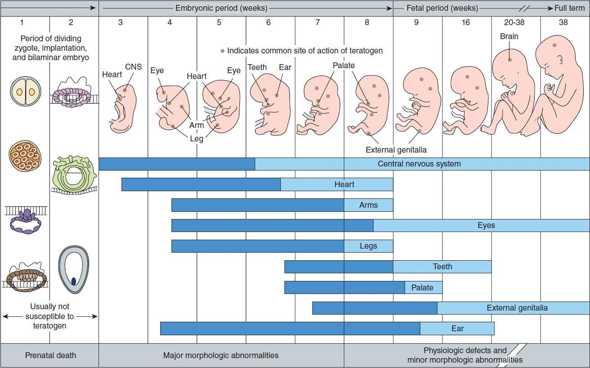

# Developmental Psychology (Part 2)
After Ali's baby brother was born, she began to talk baby-talk and suck her thumb as she did when she
was younger. What defence mechanism might she be displaying?
1. Repression
2. Rationalization
3. Regression
4. Displacement
5. Identification
> Regression

Based on our discussions last lecture, which of the following would NOT be a logical criticism of the
Rorschach ink blot test?
1. There is not enough data to know what a 'normal' response should look like
2. The participants' responses to the images are subjective and highly varied
3. The clinician's interpretation of the participant's response can be subjective
4. The results are difficult to quantify.
> There is not enough data to know what a 'normal' response should look like

Why do physicians, psychologists, and other people interested in prenatal development use gestational
age instead of fertilization age to measure the age of a fetus?
1. Gestational age is a more accurate predictor of when the fetus will be born
2. Gestational age is a more accurate predictor of when the fetus will progress through various prenatal stages
3. Pregnancies typically last for exactly 40 weeks when measured using gestational age
4. Many women do not know the exact date of fertilization
> Many women do not know the exact date of fertilization

Which of the following developmental processes consists of the encapsulation of axons in a fatty
sheath, increasing the speed and efficiency of neural processing?
1. Synaptogenesis
2. Neurogenesis
3. Synaptic pruning
4. Myelination
5. Neural tube formation
> Myelination

## Before Birth
Three states of prenatal development
1. Germinal (0-2 weeks)
    * Period of the zygote (one-celled fertilized egg)
    * Zygote travels through the fallopian tube
    * Defined as 0-2 weeks gestational age (conception until implantation)
2. Embryonic (3-8 weeks)
    * Begins when zygote implants in the wall of the uterus
    * Cell differentiation - skins cells, muscle cells, etc.
3. Fetal (9 weeks - birth)
    * Skeleton and muscles develop, allowing movement
    * Brain development occurs rapidly, allowing detection of and learning from early experiences
    * Neurogenesis and myelination

**Exogenous experience**: Experience that comes from outside the organism
* Tastes, smells, sound, tactile sensation are exogenous mostly exogenous for fetuses

**Endogenous stimulation**: Stimuli generated by the organism itself

**Fetal Vision**
* Very little light coming into the womb
* Endogenous firing of cells to allow sense of sight to develop

**Fetal Audition**
* Heartbeat changes in reaction to external voices being played
* Different reaction to music than to human speech
* Newborns recognize mother's language and voice

**Fetal Olfaction**
* 3-day old neonates turn their heads longer toward familiar amniotic fluid
* Babies respond better to food that mothers ate

**Teratogens**
* External agents that cause damage/death during prenatal development
* Alcohol, drugs, cigarettes, etc.
* Raw fish (mercury)
* Polution and fumes

**Cascading Sensitive Periods**
* Sensitive periods of development where teratogens most affect fetuses
* Periods where many sensitive periods overlap

**Fetal Alcohol Spectrum Disorder**
* Alcohol enters blood stream before being fully metabolized by the mother
* Most severe complications:
    * Facial deformities
    * Intellectual disability
    * Attention disability
    * Behaviour disorders

## Birth
* Babies spend 2/3 of a day sleeping
* Time spent sleeping goes down as people age
* Time spent crying about 2 hours and increases to a peak at about 6 weeks
* Most non-communicative until older
* *Can* be due to hunger, discomfort, pain, overstimulation

