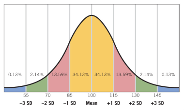

# Intelligence (Part 2)
Samantha is a 17-year-old girl with lower-than-average self esteem. If she is
like most people, when she is 65, what would you expect her self-esteem level
to be?
1. Samantha's self-esteem will increase such that by the time she is 65, she
   will have average self-esteem compared to her peers.
2. Samantha's self-esteem will decrease such that by the time she is 65, her
   self-esteem will be even further below average compared to her peeers than
   it is now.
3. Samantha's self-esteem will stay the same between now and age 65.
4. Samantha's self-esteem will increase between now and age 65, but at age 65
   she will have lower self-esteem than her peers.
> Samantha's self-esteem will increase between now and age 65, but at age 65
> she will have lower self-esteem than her peers.

When Eric was 18, he enrolled in a pre-medicine program at university because
his parents expect him to become a doctor. Now, at age 22, he realizes that
he really does not with to pursue medicine, and has to spend an extra two years
in university to get the credits for the humanities degree that he really wants.
Eric's choice of pre-medicine at age 18 could be considered an example of what,
according to Erikson?
1. Negative identity
2. Imaginary audience
3. Personal fable
4. Identity foreclosure
5. Identity confusion
> Identity foreclosure

Which of the following would you expect to be normally distributed?
1. The handedness (left, right, or ambidextrous) of students in this class
2. The birth months of students in this class
3. The IQ scores of students in this class
4. The diameters of the oak trees from a specific species in Morningside Park
5. The heights of all people in the world
> The diameters of the oak trees from a specific species in Morningside Park

How likely is that a child will score a 130 or higher on an IQ test?
> ~2% change

What percentile is a child in if she scores a 115?
> 85th percentile

How does the average IQ score of a 9-year-old compare to the average IQ score of
a 6-year-old?
> Average IQ score will be 100, since tests are designed for that age

How does the average IQ score of a 10-year-old in Canada compare to the average
IQ score of a 10-year-old in the United States?
> Average will also be 100, Canada and U.S. will have different IQ tests

## Family Environment
While genetics plays a major factor in a affecting a child's intelligence, family
environment also plays a role.
* Education of parents, gives more resources and strategies
* Stressors/early childhood adversity. Spending emotional, physical resources
  spent on stressors instead of learning their environment
* IQ scores positively correlated with protective factors
	* High parental involvement
	* Stimulating physical environment
* IQ scores negatively oorrelated with risk factors
	* Low SES
	* Low maternal education

## Schooling
School improves children's intelligence. However, the knowledge we learn does not
define intelligence.
* IQ scores higher during the school year than in the summer
* Kids that miss academic year cutoff have lower IQ scores than slightly older
  kids that made the cutoff.

## Views of Intelligence
Debunked views
* Keenness of sight
* Ethnicity

Older, valid scientific views (still used)
* Reaction time
* Speed of association
* Brain volume

Carroll's Three-Tiered Model(Factor Analysis):
1. General intelligence
   Broad level of intelligence that encompasses everything below it
2. Basic intelligence
	* Fluid intelligence
	  The ability to solve novel problems
	* Crystallized intelligence
	  The things that we know (random facts, name of friends, everything we know)
	* General memory and learning
	  How well we learn new information
3. Set of specific abilities

Intelligence itself is not observable, but correlates of it are

## Intelligence Tests

**Alfred Binet**
Invented first IQ test using trial & error
* Binet-Simon intelligence test (1904)
	* Puzzles
	* Object naming
	* Counting

Had individuals who had a certain level of occupational and educational
achievement do a battery of tests. If they did well on something, then that test
could be used to measure intelligence.

Modern IQ tests test performance on areas from the bottom tier of Caroll's TTM
* Stanford-Binet IQ test
* Wechsler Intelligence Scale for Children (WISC)
* Wechsler Adult Intelligence Scale (WAIS)
* Raven Progresive Matrices (non-verbal)

Different IQ tests for different ages
* **Ideational fluency** for 7-year-olds:
  When you see the word PLANT, what else do you think of? Name as many words
  as you can.
* **Naming facility** for 5-year-olds:
  Describing what is happening in a picture

Created for a specific age group and location
* Mean score is designed to be 100
* Standard deviation is designed to be 15
* IQ scores follow a normal distribution

Short-term reliability of IQ tests are quite good. Long term reliability is less
consistent. Infant IQ doesn't reliably predict child/adult IQ. Child and adult
IQ are correlated, but correlation is lower with longer time intervals.
