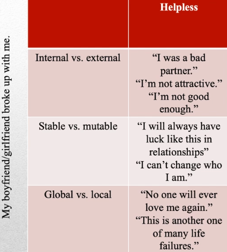
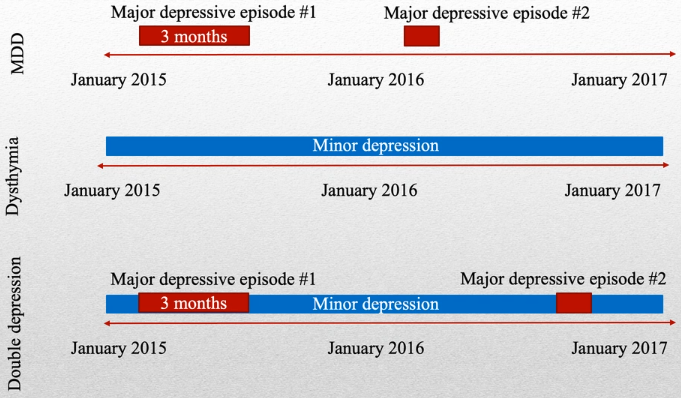

# Clinical Psychology (Part 2)

## Anxiety Disorders
Anxiety disorder can be divided into two components, fear and anxiety.

**Fear**: Automatic emotional response experienced when faced with a threatening
stimulus.

**Anxiety**: Anticipation of a negative stimulus.

Fear and anxiety are adaptive reactions to threats. It is typical to be fearful
of a hungry lion, or anxious about an upcoming exam.

However, anxiety becomes a problem when it interferes with normal functioning
(maladaptive), and decreases our fitness for survival.

This pathological anxiety can be classified as one of many anxiety disorders.
They are very common (estimated 30% of people in Canada will experience one,
although only about 5% of people are ever diagnosed).

## Generalized Anxiety Disorder
Generalized Anxiety Disorder is an anxiety disorder in which worries are not
focused on any specific threat. Anxiety about many different things. People
with GAD report that even though there isnt anything in their life particularly
stressful, their anxiety seems to find something to settle on.

Diagnostic Criteria:
1. Excessive anxiety and worry, occur more days than not for at least 6 months,
   about more than one event/stressor.
2. Individual finds it difficult to control the worry.
3. Three or more of these symptoms:
	* Restlessness
	* Fatigue
	* Concentration deficiency
	* Irritability
	* Muscle tension
	* Sleep disturbance
	* The three common criteria for all psychological disorders

Onset of GAD rarely occurs prior to adolescence.
* Median age for dignosis is age 30.
* Many patients report having anxiety symptoms for a long time before reporting
  them.
* In the population level, level of anxiety is constant throughout the lifespan.
  No age group where anxiety is higher than in other age groups.
* In the individual level, severity of symptoms waxes and wanes across the
  lifespan
* Content of worries change (report card, mortgage, life span)
* Full remission (symptom free) is rare

## Phobic Disorders
Disorder characterized by marked, persistent, excessive fear of **specific**
objects, activities, or situations. Person usually recognizes the irrationality
of their fear, but cant control it.

* Specific phobia (12% prevalance)
	* Animals (dogs, cats, spiders, snakes)
	* Natural environments (earthquakes, darkness)
	* Situations (elevators, enclosed spaces)
	* Medical events (blood, injections, injury)
	* Other (loud noises, costumed characters, choking)
* Social phobia (13% prevelance)
	* Maladaptive fear of being publicly humiliated or embarassed

**Preparedness Theory**: We may be evolutionarily adapted to fear certain types
of stimulus. Evidence for this hypothesis comes from **conditioning** (Monkeys
can easily be conditioned to fear snakes, but not flowers). These fears may be
overdeveloped in some individuals.

## Panic Disorders
Feelings of panic are normal when faced with immediate, life-threatening
danger. But many individuals experience panic even when not in danger.

Panic disorder is the sudden occurence of multiple psychological and physical
symptoms typically associated with terror including:
* shortness of breath
* heart palpitations
* sweating
* dizziness
* derealisation (feeling that the world is unreal)
* fear of death/losing one's mind

Panic episodes are relatively common.
* About 1/3 of Canadians experience a panic attack once or more per year,
	typically during extreme stress
* To be diagnosed, an individual must experience
	* recurrent, unexpected attacks
	* significant fear of another attack

## Mood Disorders
Mood is an emotional state that is
* long-lasting
* non-specific
* not caused by a particular stimulus
* affects our behaviour, cognition, and emotions

Mood disorders are well-known. They have mood distubance as their prominent
feature. 

## Depressive disorders
* 22% female and 14% male Canadian population
	* Hormonal differences
	* Higher diagnoses
	* Different coping strategies (including sharing and co-rumination)
* About 1 in 12 Canadians will experience major depression in their lives
* Sometimes depression lasts for a long time

## Major depressive disorder (unipolar depession)
Most well-known depressive disorder. Severely depressed mood and/or inability
to experience pleasure that lasts two or more weeks and is accompanied by
feelings of worthlessness, lethargy, sleep disturbance, and/or appetite
disturbance.

Diagnostic Criteria:
1. Five or more of the following symptoms present during the same 2-week period
	* Depressed mood
	* Diminished interest
	* Significant weight loss/gain
	* Insomnia or hypersomnia
	* Psychomotor agitation or retardation
	* Fatigue
	* Feelings of worthlessness/guilt
	* Diminished concentration/decisiveness
	* Recurrent thoughts of death/suicidal ideation
2. No evidence of a **manic** episode (abnormal, persistent high mood)
3. Symptoms cause clinically significant distress/impairment
4. Not better described by another DSM disorder
5. Not attributable to another medical condition or physiological effects of
   substance use.

Onset: May appear at any age, but is more likely to appear in the 20s

Prognosis:
* 2/5 of individuals recover within 3 months
* 4/5 of individuals recover within 1 year
* 1/5 of individuals do not experience remission

Risk factors:
* Temperamental (particularly neuroticism, or negative affect)
* Environmental (childhood experiences, stressful life events)
* Biological (neurotransmitter imbalance)
* Gentic (family members of individuals with MDD are 2-4 times more likely to
  be diagnosed with MDD; ~40% heritability)

Comorbidity:
* Substance-related disorders, panic disorders, obsessive-compulsive disorders,
  anorexia nervosa, bulimia nervosa

Psychological factors can affect an individual's susceptibility to depression.
Many theorists argue that it is the way we think about things that cause
depression, rather than the things themselves.

**Helplessness Theory**: The way a person thinks about failure makes them more
or less likely to be depressed.
* Attribute failures to internal characteristics
* Believe that failures are permanent (stable)
* Believe that failures are global (apply to many areas of life)

## Dysthymia/Double Depression
Moderate depressive symptoms that last for more than two years are referred
to as **dysthymia** or **dysthymic disorder**

When dysthymia is puntuated by episodes of major depression, it is called
**double depression** (both at the same time).

