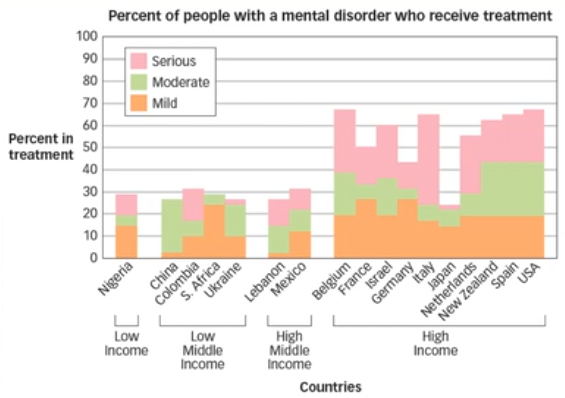
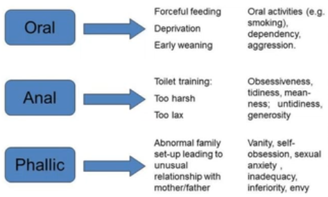

# Treatment of Psychological Disorders (Part 1)

Types of clinicians:
* Psychiatrist
	* Psychiatrists have gone to medical school along with family
		doctors/surgeons, but have specialized in mental health
	* Can diagnose, prescribe, and practice psychotherapy
* Psychologist
	* Have specialised in psychology at the graduate level
	* Two types of psychologists: clinical and research
		* Clinical psychologists study the treatment of mental disorders, can
			diagnose and practice psychotherapy
		* School psychologists focused on administering psychotherapy and treatment
			in a school setting. Can practise psychotherapy, but cant prescribe
		* Clinical counsellors can practice psychotherapy
		* Social workers can practice psychotherapy

## Treatment
After a diagnosis, there are two types of treatments:
* Psychological treatment - consisting of psychotherapy
* Biological treatment - consisting of medication or in some cases surgery

Why should we treat psychological disorders?
* Personal and social costs. Inability to carry out daily activities, manage
	relationships
* Financial costs. ~$51 billion per year in lost work.
* These impairments are just as severe as those associated with physical
	illness

Getting access to treatment is one of the biggest challenges in mental health.
* 20% of Canadians suffer from a moderate to serious mental health disorder at
	some point in their lives.
* ~40% of those seek treatment
* 1/3 of those seeking treatment are unsatisfied with the level of treatment
	they receive.
* Canada has comparatively great access to mental health treatment.

Why do people fail to get treatment?
1. People don't realize they have a disorder
2. People do not typically understand mental illness as well as they understand
	 physical illness
3. Psychological beliefs prevent people from seeking treatment
	* Believe they can treat themselves (72.6%)
	* Believe mental health problems are not that severe (16.4%)
	* Believe that they will be stigmatized by others for seeking mental health
		treatment (9.1%)
4. Structural barriers to seeking are
	* Knowing where to look
	* Not enough clinicians
	* We've learned that videotherapy can be just as effective as in-person
		therapy
	* Cost
		* How does insurance work with mental health care?
		* OHIP does not cover psychologists/counsellors/social workers
		* Private insurance often has low limits on these types of professionals

## Psychological Treatment
There are many types of psychological treatment, or psychotherapy. Techniques
in psychotherapy are referred to as **orientations**.

## Psychodynamic Therapy
In a psychoanalytic session, we would expect to discuss:
* Childhood events
* Dreams

This therapy is centered on the belief that psychological problems come from
ineffectively repressing aggressive or sexual urges in childhood.
Psychoanalysis attempts to give the patient **insight** into these conflicts.

Has its roots in Freud's methods of *psychoanalysis*

Freud fixation + adult personality:

Disruptions in certain stages led to specific types of behaviours in adulthood.

**Interpersonal psychotherapy (IPT)** has replaced some of Freud's methods with
a focus on:
* Grief (loss of a relationship)
* Role disputes (conflicts within a relationship)
* Role transitions (changes in life status, jobs, etc.)
* Interpersonal deficits (lack of skills to start/maintain relationships)

## Humanistic/Existential Therapies
Humanistic psychologists emphasize:
* The importance of striving for personal improvement
* Free will
* The positive aspects of the human experience

**Person-centered Therapy** assumes individuals have a tendency towards growth;
centres on acceptance and genuine reactions from therapist
* Unconditional positive regard, even if they themself don't agree with them
* Empathy
* Congruence (words, body language, etc.)
* Therapist acts as a mirror that reflects the individuals sentiments in
	positive ways
