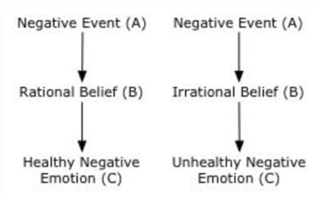

# Treatment of Psychological Disorders (Part 2)

## Behavioural/Cognitive Therapy
Most common type of psychotherapy in Canada, probably because of the wealth of
evidence suggesting their efficacy.

Behavioural/cognitive therapy relies on **behaviouism**- study of observable,
measurable variables

Focuses on changing **behaviour**(action) or **cognition**(thoughts) to combat mental
illess.

Behavioural therapy centers around **conditioning**:
* Operant Conditioning
	* Rewards for positive behaviour; punishments for negative behaviour
	* One method is token economy: rewarding positive behaviour with vouchers
* Classical Conditioning
	* The most common way CC is used is in Exposure therapy
		* Harmless, repeated exposure to a stimulus believed to be threatening
		* Results in reduction in threat response

While behavioural therapy workds to change actions, cognitive therapy works to
change unhealthy thought patterns leading to mental illness. Cognitive
therapists focus on restructuring irrational thought process
* A therapeutic approach that teaches clients to question the automatic
	beliefs, assumptions, and predictions that lead to negative emotions
	* I will never make friends - What friends have you had in the past? Where?
		When?
	* I will never be able to succeed in school - What successes have you had in
		the past? Where? When?
* Replaces irrational, negative thoughts with rational, positive ones.

Many therapists combine behavioural and cognitive orientations into one
technique: **cognitive-behavioural therapy** (CBT). Most common psychological
treatment for depession and anxiety. CBT is:
* Problem focused
* Action oriented - individual often assigned homework to combat thoughts
* Transparent (unlike psychoanalysis) - therapist explains the whole process to
	the patient, some of the theory behind it

CBT uses the ABC model:
* Activating Event
	* Actual event - losing a cat
	* Client's immediate interpretation of event - will never have a pet like it
* Beliefs
	* Evaluation
	* Rational/Irrational belief
* Consequences
	* Emotions
	* Behaviours
	* Other thoughts

CBT aims to change irrational beliefs on the right to rational beliefs on the
left. Instead of wallowing in depression, become hopeful for the future.

