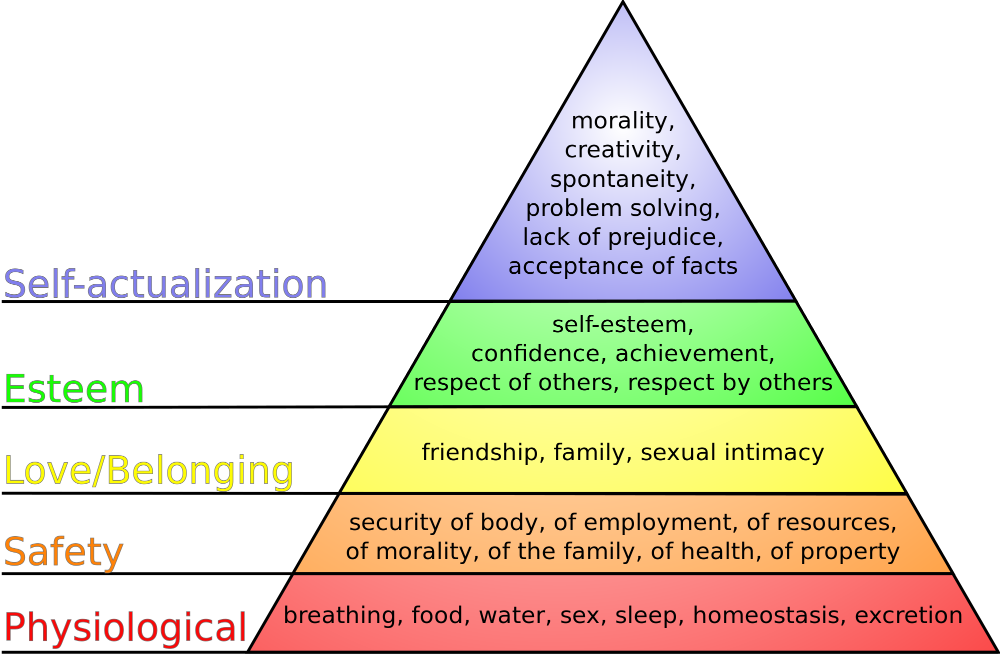

# Developmental Psychology

Match each Big Five personality dimension with the personality trait to which it is highly correlated
1. Openness to new experience
2. Conscientiousness
3. Extraversion
4. Agreeableness
5. Neuroticism
> Hesitant, Lazy, Outgoing, Friendly, Level-headed

According to the trait theory of personality, what s the largest factor in determining an individual's personality?
1. Parental Discipline
2. Genetics
3. Early childhood experience
4. Cultural values
5. Gender
> Genetics

Samantha has just taken a personality test designed to measure her conscientiousness. The test is clinically valid
reliable. Samantha scores in the 89th percentile for conscientiousnes (she is highly conscientious). Based on
this result, on which of the other Big Five traits do you expect Samantha to also score highly?
1. Openness to new experience
2. Extraversion
3. Agreeableness
4. Neuroticism
5. None of the above
> None of the above

Aaron feels that his younger son, Jacob, is unattractive and not very smart. He accuses his wife of picking
on Jacob and favouring their other son. What defence mechanisms might Aaron be displaying in his accusation
of his wife?
1. Displacement
2. Projection
3. Sublimation
4. Reaction Formation
5. Identification
> Projection

## Psychodynamic Approach

### Sigmund Freud (Maybe from PSYA01)
* Austrian physician practicing neurology, study of disorders of the nervous system.
* Treated patients for "hysteria"
* Developed **psychoanalysis** based on patient's free associations, fantasies, and dreams
> Hysteria - Exagerrated or uncontrollable emotion or excitement

Psychodynamic theory extends from Freud's approach
* Personality is formed by needs, strivings, and desires largely operating **outside of awareness**
* Motives that can also produce emotional disorders
* Called the **dynamic unconscious**
    > An active system encompassing a lifetime of hidden memories, the person's deepest
    > instincts and desires, and the person's inner struggle to control those forces

### Psychodynamic Theory
Freud divided this dynamic (un)conscious into three parts
* Id - unconscious, animal desires
* Ego - more conscious, control animalistic desires, for life's practical demands
    * planning
    * future goals
    * can't constantly act on id, or we can't advance our goals
* Superego - internalize cultural/social rules
Personality is determined by which of these parts of the unconscious are dominant

Conflicts between the three parts cause **anxiety**
To resolve this anxiety, we rely on **defence mechanisms**
* Repression - push thoughts away, ignore, and deny
* Rationalization - explain, give motivation for feeling 
* Reaction formation - acting in way that is opposite of insecurity
    > person that is weak starts acting tough and macho
* Projection - criticizing another person for behaving in a way you feel yourself
    > having a bad time at a party, and saying someone else looks like they're having a bad time
* Regression - return to a more childish version of yourself
* Displacement - take out anger to someone/something that is not the cause of the feeling
    > slamming a door after an argument
* Identification - identify with the cause of the negative feelings
    > kid being bullied becomes a bully themself
* Sublimation - taking their negative emotionality and turning it into something positive
    > kid experiences bullying, and starts anti-bullying club

### Projective Techniques
Analyze responses to standard series of ambiguous stimuli. Reveal inner aspects of individual's personalities.
Pictures of people, objects, events, or abstract stimuli shown to subjects
* Rorschach Ink Blot test
    * inner thoughts and feelings revealed by analysis of their responses
    * common set of responses, uncommon might mean something wrong
* Thematic apperception test (TAT)
    * shown a card and told to make a story based on it
    * common sets of responses
    * might correlate similar themes to similar problems

Lots of criticisms:
* Clinician or social pressure can alter results. Patient crafts responses
* Results difficult to interpret
* Interpretations are too subjective, relies on clinician's own psychology
* Mixed empirical evidence to support them
* Focus on after-the-fact interpretation, no predictive power
* Reject free will, everything predetermined by early childhood experience
* Based on biased sample
* Are unfalsifiable, hard to argue results are right or wrong

## Humanistic-Existential Approach
Argues humans seek out a realization of their inner potential (self-actualization)
* pursuit of knowledge
* expression of creativity
* spiritual enlightenment
* give back to society

### Needs Hierarchy

* Need to satisfy needs from the bottom of the pyramid before we can move up
* **Personality differences** arise from environmental constraints against climbing our needs hierarchy

> Sarah is a highly creative person with a natural talent for story-telling. However, she lives in a war
> torn developing nation, and is too busy making sure her family have enough to eat and are safe. She
> cannot explore her talent. She is less agreeable than she would be if she could explore her talent.

## Human Development (Part 1)
Examination of **continuity** and **change** across the lifespan on these topics:
* Sensation and perception
* Cognition and language
* Emotion
* Social and moral behaviour
Will cover four main periods of human development
* Prenatality and infancy (conception-2,3 years)
* Childhood (2,3-11 years)
* Adolescence (12-17 years)
* Adulthood (18-death)

* Early memories are often vague or non-existent.
* Early experiences in infancy are crucial to normal development
* Gives rise to many individual differences across human population
* Human experience begins with **conception** not birth
* Infant at 20-22 weeks can experience sound 

### Prenatal Development
Period of time prior to birth
* Gestational age is time since beginning of last menstrual period
    > Mothers dont always know time of fertilization but know time of last period

